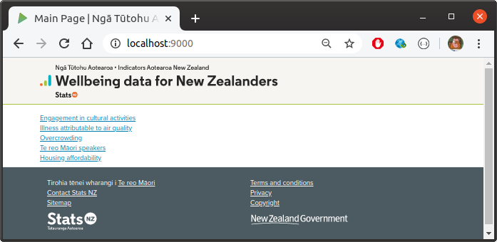
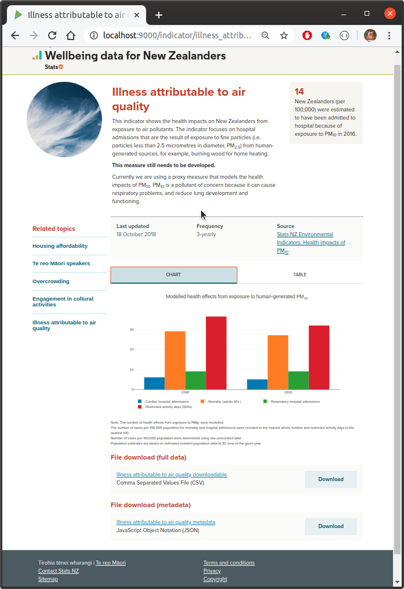
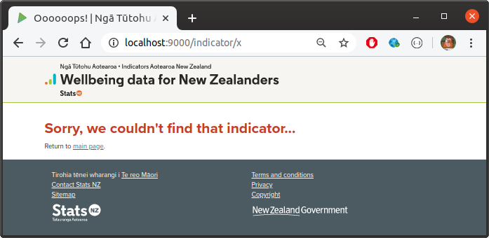
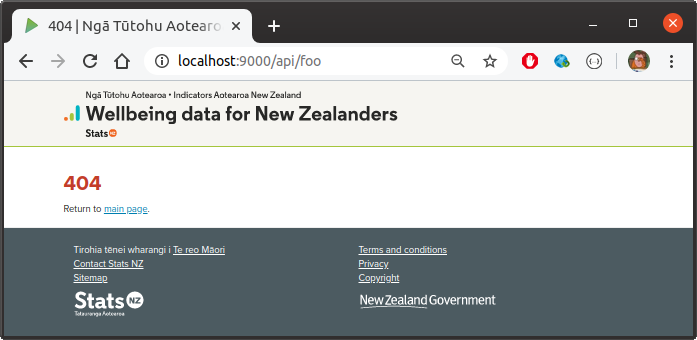
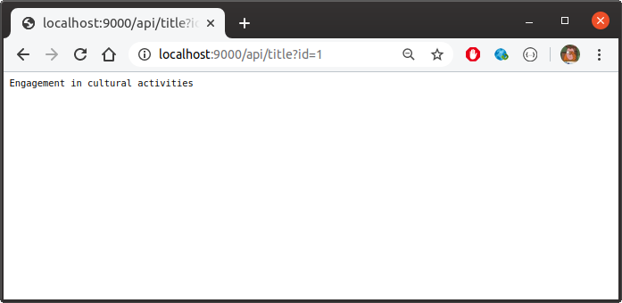
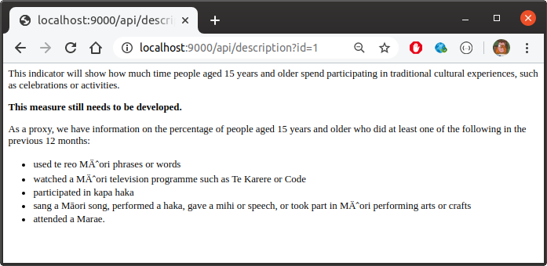
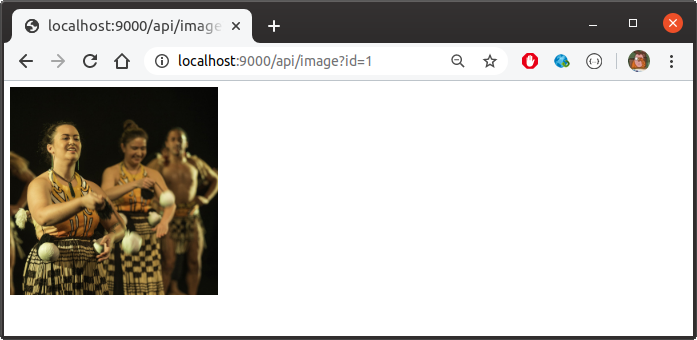
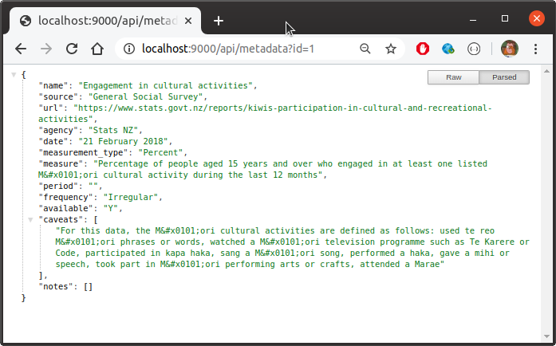

# IANZ Templated PoC

This project contains a simplified version of the [Wellbeing Indicators](https://indicators.cwp.govt.nz/) website as a demonstration of how such a site might instead be built to be dynamic.  

The PoC is written in Scala using the [Play Framework](https://www.playframework.com/), and, essentially, consists of a single template that is populated dynamically.  The indicators themselves are provided as files in specific formats, all placed in a single folder which is read by configuration.  The project is provided with just 5 indicators, but if more were added to the folder, then all that would be required to include them would be to restart the application.

As a further conceptual demonstration, a small number of endpoints have also created so that data can also be retrieved programmatically.


# Running the Application / Web Site

To build a self-contained zip which can be deployed anywhere, simply run:

```bash
sbt dist
```

This will produce something like `target/universal/ianzpoc-1.0-SNAPSHOT.zip`.  Simply unzip the archive and then simply start the application via:

```
cd <path-to-app> && bin/ianzpoc
```

By default, the app assumes that indicator data can be read from `./indicators`.  If this is not the case, then the `appdata` configuration variable must be overridden as appropriate.  This can be done easily at the command-line as follows:

```
<path-to-app>/bin/ianzpoc -Dappdata=/path-to-indicators/indicators
```

The app will run on port 9000, so can be accessed at `http://localhost:9000`.


# Screenshots


















